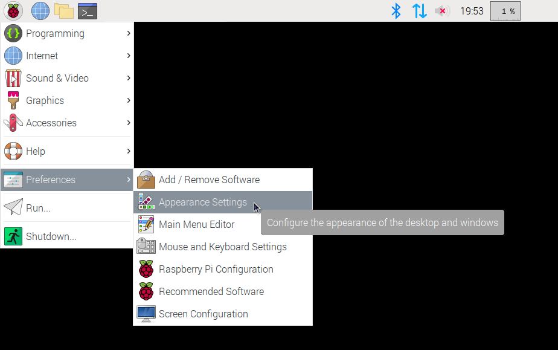
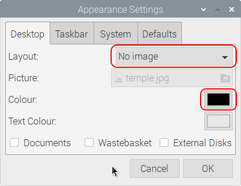
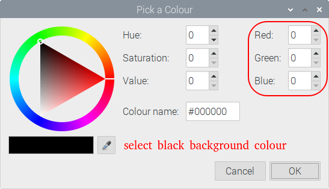
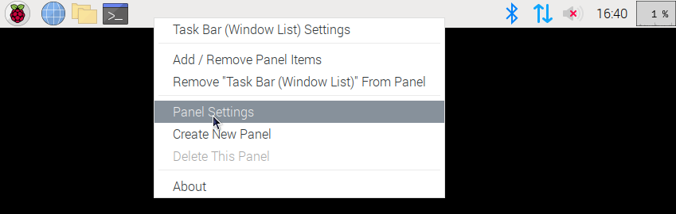
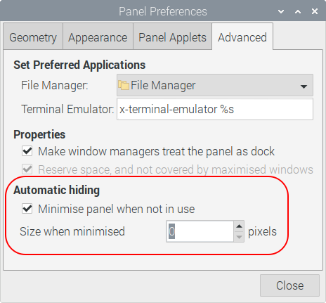

# RaVidPlay -- Random Video Player
yet another omxplayer wrapper which plays random video sequences. When pressing
a buzzer push button, an action or countdown video is shown and a trigger
signal is provided on an GPIO pin. The intended usage is as part of a
photobooth equipment but it can also run stand-alone.

## GPIO connections
* GPIO17 (pin 11): buzzer push button
* GPIO7 (pin 26): trigger signal for external camera
* GPIO23 (pin 16): a small and hidden switch to exit the software

## Description
This program uses the `omxplayer` software on the Raspberry Pi to show (short)
videos in a random order. To achieve a smooth fading between two videos this
program uses two instances of `omxplayer`.

This software starts a loop which manages the video playback by using two
`omxplayer` instances to show some so-called *idle videos* which should arouse
attention from the audience.  
Further a *countdown video* will be played if the input GPIO17 is tied to GND.
Two seconds before the countdown video will end, an impulse is provided at 
GPIO7. It takes about one second. This signal may be used to trigger another
device taking a photo. While the countdown video is playing any further ties
to GND of GPIO17 will be ignored. This behaviour avoids errors due to multiple
pushes of the buzzer pushbutton.  
After the countdown video has finished an *applause video* will be selected and
started. It is internally handled like an idle video. The idle loop keeps on
runnung until GPIO17 is tied to GND again.

if GPIO23 is tied to GND the video loop will end and the software therefore
exits.

## Planned but not yet implemented
The video parameters like transparency, fading times etc. should be fetched
in this priority order:  
1) done -- take the values given in the source code
2) done -- read the global config file ~/.config/ravidplay.py.conf and update the values
3) done -- update all values given by commandline parameters
4) OPEN -- read a local config file with same filename as the according video

Configurable window sizes for both omxplayer instances

Applause video:  
Don't take next video of list while waiting for free omxplayer instance on
sequential playing order (`randomindex_appl=0`)

## Software Installation and Quick Start on the Raspberry Pi
Clone this repository onto the Raspberry Pi and start the installation
shell script [`ravidplay_setup.sh`](https://github.com/schlizbaeda/ravidplay/blob/main/ravidplay-setup.sh)
in an LXTerminal:
```shell
cd /home/pi
git clone https://github.com/schlizbaeda/ravidplay
cd ravidplay
./ravidplay-setup.sh

./ravidplay.py -idle: videos/idle/* -cntdn: videos/cntdn/* -appl: videos/appl/*
```

## Adjustment of Raspberry Pi OS desktop
Despite RaVidPlay is running on *Raspberry Pi OS* independent of the chosen
desktop settings it would be useful to keep these adjustments in mind:

#### OS-dialogue "Appearance settings"
Disable any background images and select a neutral colour like *black* or
some kind of *dark grey* instead. This creates a dark background, especially
if video sequences are fading into each other.

1) Select item "Appearance Settings" in the *Raspberry Pi OS* main menu:  
   

2) Disable the background image if one is selected  
   and change the background colour to a dark and neutral one:  
   

3) Select an appropriate colour like *black*  
     
   In some use cases *white* or a very lighting colour would be ok, too.

#### Taskbar adjustments in OS-dialogue "Panel Settings"
Clean-up the desktop area. Remove all desktop icons if there are any
and minimise the taskbar size to 0

4) Open the dialogue by right-clicking onto the taskbar and selecting the item
   "Panel Settings".  
   
   
5) Select the tab "Advanced" and activiate the section **Automatic hiding**
   * Activiate the check box "Minimise panel when not in use"
   * Set "Size when minimised" to 0 pixels
   
   
